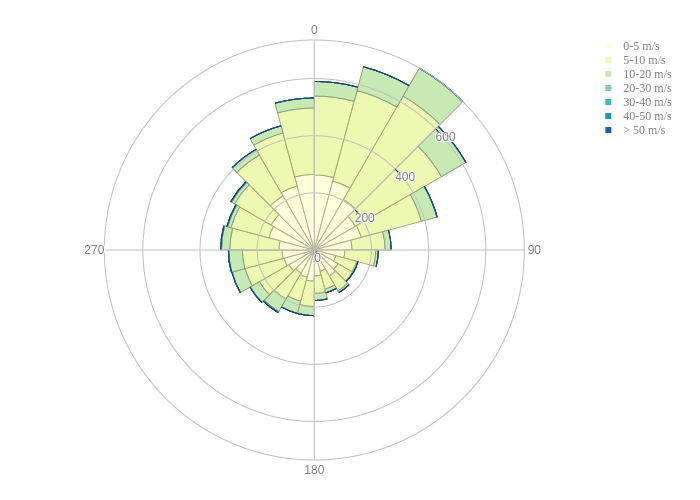

.. _other functionalities:

Other functionalities of the package
====================================

The molecularprofiles package comes with a set of functions that may be useful to interact with the meteorological data for the CTA.

In order to load them one needs to import these functions within a Python interpreter:

.. code-block:: python

    > from molecularprofiles.utils.dataframe_ops import *

This will load all the functions contained within the dataframe_ops.py script.

For instance, once we have successfully loaded some data using the steps described in :doc:`the MolecularProfile class`. 

Once we have loaded the data we can start interacting with the dataframe that is created and, for instance, use a function to plot a wind-rose graphic of the direction and speed of the wind. In order to do this plot we can simply do:

.. code-block:: python

	> ecmwf = MolecularProfile('input_grib_file.grb', data_server='ECMWF', observatory='north')
	> ecmwf.get_data()
	> dfw = create_wind_speed_dataframe(ecmwf.dataframe)
	> plot_wind_rose(dfw)

The result of these actions will be a plot, that is saved into the working directory, similar to this:

