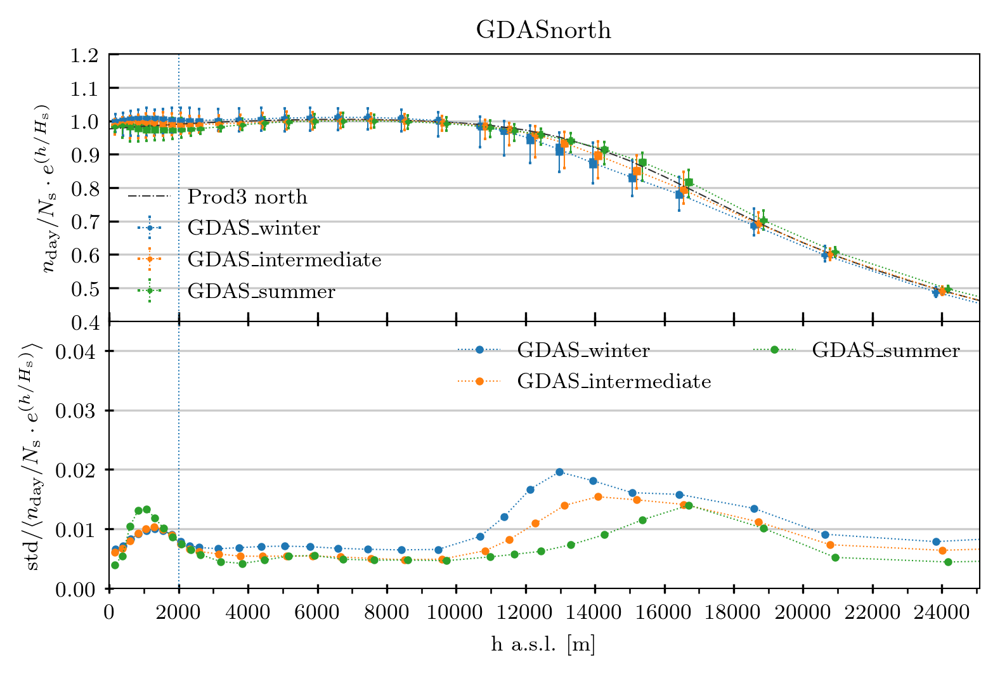

.. _the MolecularProfile class

the MolecularProfile class
==========================

In this section we will explore the MolecularProfile class within the molecularprofiles python package.

This is a class that allows the user to load data from a meteorological data assimilation system (GDAS or ECMWF) and analyze it.

This class is supposed to work within a python environment. It works with Python 3.6.

The class object can be created as follows:

.. code-block:: python

    > ecmwf = MolecularProfile('input_grib_file.grb', data_server='ECMWF', observatory='north')

This creates the object **ecmwf** and from here we can start working and analyzing its data. The first thing we need to do is to load the data:

.. code-block:: python

    > ecmwf.get_data()

This call will check if there is any file named as the input filename but with 'txt' extension in the working directory. If there is not, it will call grib_utils.py and extract the information from the input grib file and create a new file, contaning a table of data, and named as the input file but with the extension changed to 'txt'. If there is such a file in the working directory, the program simply reads it and loads its data.

The *get_data* function has many options to filter the data: by year, month, day, good weather conditions, epochs (predefined group of months: winter, summer and intermediate for north; winter and summer for south; etc.). 

Once the data is read and loaded, the ecmwf object will have a dataframe instance, that actually contains the data table. It can be read and operated with by means of the Pandas package and its functions. We can see this dataframe by doing:

.. code-block:: python

    > ecmwf.dataframe.head()

When the data is loaded, other instances are created within the object:

- ecmwf.h_avgs
- ecmwf.n_avgs
- ecmwf.n_exp_avgs
- ecmwf.RH_avgs

These quantities are multidimensional arrays containing the average over all the dataframe of each quantity, its standard deviation and its maximum and minimum (extreme) values. There is a value for each of the pressure (P) levels.

Now that we have the data, we can make some plots by means of the several plotting functions present in the class:

- **plot_moist_dry_comparison**: makes a plot of the molecular profile comparing the density computed without taking into account the relative humidity and the molecular profile that has taken into account the relative humidity
- **plot_average_at_15km**: plots the average density at 15 km above sea level versus time, in MJD. At his height the changes in density are wider than at other altitudes
- **plot_wind_by_altitude**: plots, in polar coordinates, the wind speed and direction at a given epoch and altitude
- **plot_differences_wrt_model**: plots the difference, in %, between the server data and the standard model (either PROD3 or MAGIC_Winter) for each of the altitude levels
- **plot_models_comparison**: plots the server data together with the predefined models (PROD3 or MAGIC_winter) in a single plot
- **plot_epoch_comparison**: plots the different predefined epochs (winter, summer, intermediate) together for comparison. In a lower panel, the coefficient of variation for each epoch is also plotted

For instance, in order to produce a comparison between the PROD3 model and three different predefined epochs we can type:

.. code-block:: python

	> epochs = ['winter', 'summer', 'intermediate']
    > ecmwf.plot_epoch_comparison(epochs, plot_PROD3=True)

This will generate the following plot:

where we have a data point at the average height that has the average molecular density, its standard deviation as a thick errorbar and the peak-to-peak values as a thin errorbar, and also the PROD3 dashed line to compare (top panel). The coefficient of variation is plotted in the bottom panel for each of the epochs.

The class also allows the user to produce txt files that are compliant with what CORSIKA (the software for air showers simulation) expects as the molecular profile information.
In order to produce such file, the user needs to call this function:

.. code-block:: python

    > ecmwf.write_corsika()

A txt file table will be produced and it is ready for its use within CORSIKA.

Other methods within the class (which are not directly called by the final user, normally) are:

- ecmwf._compute_diff_wrt_model
- ecmwf._compute_mas_density
- ecmwf._get_prod3sim_data
- ecmwf._interpolate_param_to_h
- ecmwf._interpolate_simple
- ecmwf._refractive_index

**Example of filtering the data:**

.. code-block:: python

    > ecmwf = MolecularProfile('input_grib_file.grb', data_server='ECMWF', observatory='north')
    > ecmwf.get_data(epoch=['summer', 'intermediate'], altitude=[2000, 2200], years=[2013, 2015])

With these instructions, the final dataset will contain only data from years 2013 and 2015, for epochs called 'summer' and 'intermediate' and only for altitude levels between 2000 and 2200 m above sea level.